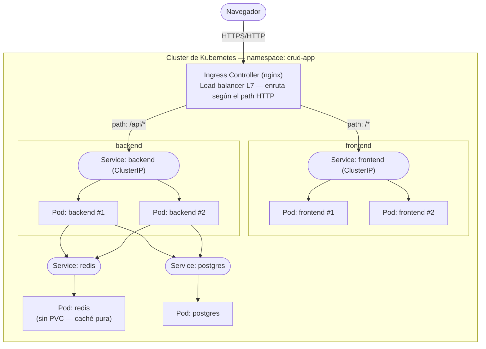
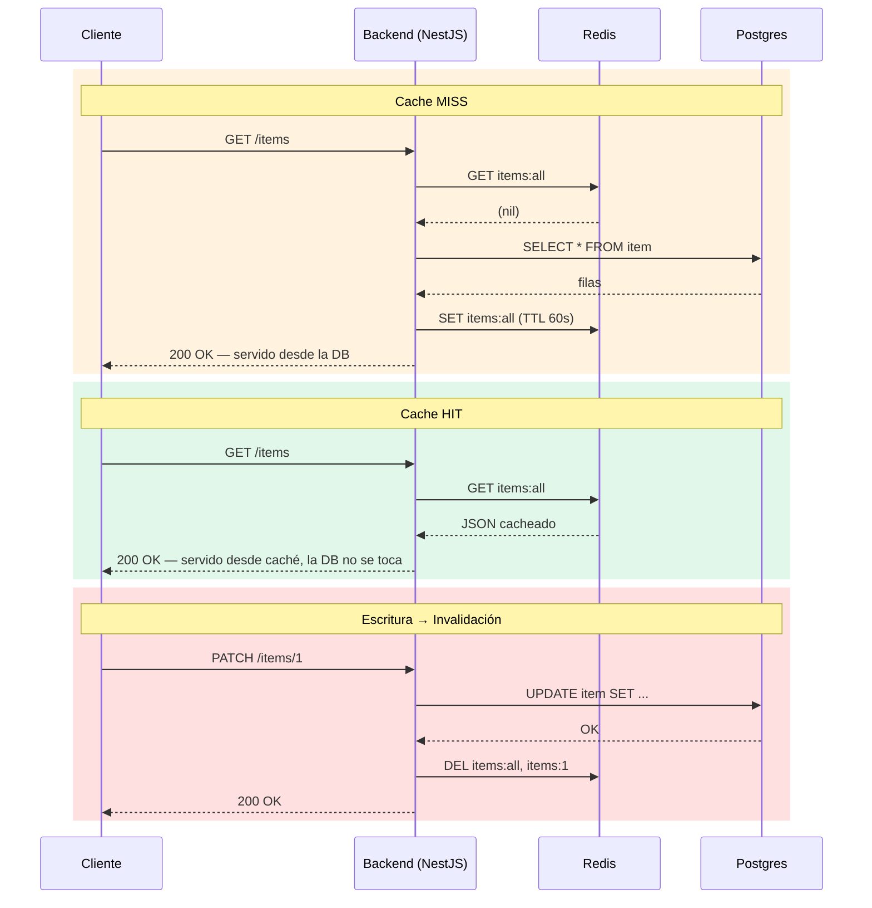

<div align="center">

# CRUD en Kubernetes — Load Balancing e Invalidación de Caché

Una pequeña app full-stack de tipo CRUD, usada como playground práctico para conceptos
centrales de sistemas distribuidos: **load balancing L7, escalado horizontal, el patrón
cache-aside con invalidación explícita de caché, y orquestación de contenedores con
Kubernetes.**

[](https://nestjs.com/)
[](https://react.dev/)
[](https://www.postgresql.org/)
[](https://redis.io/)
[](https://www.docker.com/)
[](https://kubernetes.io/)
[](https://www.typescriptlang.org/)

</div>

---

## Índice

- [Descripción general](#descripción-general)
- [Conceptos de diseño de sistemas demostrados](#conceptos-de-diseño-de-sistemas-demostrados)
- [Arquitectura](#arquitectura)
- [Load balancing: L4 vs L7, y qué balancea qué](#load-balancing-l4-vs-l7-y-qué-balancea-qué)
- [Caché: cache-aside con invalidación explícita](#caché-cache-aside-con-invalidación-explícita)
- [Stack tecnológico](#stack-tecnológico)
- [Estructura del proyecto](#estructura-del-proyecto)
- [Referencia de la API](#referencia-de-la-api)
- [Cómo empezar](#cómo-empezar)
  - [1. Desarrollo local](#1-desarrollo-local-sin-docker)
  - [2. Construir imágenes Docker](#2-construir-imágenes-docker)
  - [3. Desplegar en Kubernetes](#3-desplegar-en-kubernetes)
- [Observar el sistema bajo carga](#observar-el-sistema-bajo-carga)

---

## Descripción general

Este repo es intencionalmente un **CRUD simple** (crear/leer/actualizar/borrar "items")
— el punto no es la lógica de negocio, sino la infraestructura alrededor. Está armado
para responder, de forma concreta y con código que corre, preguntas como:

- ¿Qué balancea realmente un load balancer, y en qué capa?
- ¿Qué pasa en un cache hit vs. un cache miss, y cómo evitás que una caché sirva datos
  desactualizados después de una escritura?
- ¿Cómo convierte Kubernetes un puñado de archivos YAML en un sistema autorreparable y
  escalable horizontalmente?

Cada concepto de abajo está respaldado por código real en este repo, no solo por un
diagrama explicativo.

## Conceptos de diseño de sistemas demostrados

| Concepto | Dónde vive | Por qué importa |
|---|---|---|
| **Load balancing / routing L7** | [`k8s/05-ingress.yaml`](./k8s/05-ingress.yaml) | Un único Ingress (nginx) es el único punto de entrada externo; enruta según el path HTTP (`/api/*` → backend, `/*` → frontend) |
| **Escalado horizontal** | [`k8s/03-backend.yaml`](./k8s/03-backend.yaml), [`k8s/04-frontend.yaml`](./k8s/04-frontend.yaml) | Backend y frontend corren 2 réplicas cada uno; los Services de Kubernetes balancean entre los endpoints de los pods |
| **Patrón cache-aside** | [`backend/src/items/items.service.ts`](./backend/src/items/items.service.ts) | Las lecturas consultan Redis antes de ir a Postgres; los misses se guardan de vuelta en la caché con un TTL |
| **Invalidación explícita de caché** | mismo archivo | Cada escritura (`POST`/`PATCH`/`DELETE`) borra las claves de caché afectadas para que la próxima lectura no pueda servir datos desactualizados |
| **Resiliencia fail-open** | [`backend/src/redis/redis.module.ts`](./backend/src/redis/redis.module.ts) | Si Redis no está disponible, la app registra una advertencia y usa Postgres en su lugar, en vez de caerse — una caché nunca debería ser un punto único de falla |
| **Health checks / auto-reparación** | archivos de `k8s/` | `readinessProbe`/`livenessProbe` en los Deployments; Kubernetes reinicia o deja de enrutar tráfico a los pods no saludables automáticamente |
| **Contenedores multi-stage** | [`backend/Dockerfile`](./backend/Dockerfile), [`frontend/Dockerfile`](./frontend/Dockerfile) | La etapa de build compila la app; la etapa de runtime solo incluye dependencias de producción sobre una imagen Alpine liviana |
| **Almacenamiento persistente vs. efímero** | [`k8s/01-postgres.yaml`](./k8s/01-postgres.yaml) vs [`k8s/02-redis.yaml`](./k8s/02-redis.yaml) | Postgres es la fuente de verdad; Redis intencionalmente no persiste nada (es una caché, se puede perder sin problema) |
| **Gestión de secretos** | [`k8s/01-postgres.yaml`](./k8s/01-postgres.yaml) | Las credenciales de la DB se inyectan mediante un `Secret` de Kubernetes, no hardcodeadas en el Deployment |

> Nota: como parte de simplificar los manifiestos para práctica, se sacaron los
> `readinessProbe`/`livenessProbe`, el `PersistentVolumeClaim` de Postgres y los límites
> de `resources` de varios archivos en `k8s/`. Esta tabla describe la versión
> "producción" original del diseño.

## Arquitectura



El Ingress es lo único expuesto fuera del cluster. Todo lo que está detrás —
Services, pods, Postgres, Redis — es interno, alcanzable solo por el DNS interno del
cluster (`backend`, `postgres`, `redis`).

## Load balancing: L4 vs L7, y qué balancea qué

Hay **dos capas de load balancing distintas** en este sistema, cada una resolviendo un
problema diferente:

1. **Capa 7 — el Ingress controller.** Lee el path HTTP de cada request y decide *qué
   aplicación* debe manejarla (`/api/*` → backend, todo lo demás → frontend). Como
   necesita entender el contenido de la request, tiene que operar en L7. Habla
   directamente con los endpoints de los pods (evitando kube-proxy) y balancea entre
   ellos usando round-robin por defecto.
2. **Capa 4 / kube-proxy — los Services de Kubernetes.** Cualquier tráfico enviado a la
   ClusterIP de un Service (por ej. `backend:3000` desde dentro del cluster) se
   distribuye entre los endpoints saludables de ese Service a nivel de conexión, sin
   ninguna noción del contenido HTTP.

**Regla general:** usá L7 cuando la decisión de enrutamiento depende de *lo que hay
dentro* de la request (path, host, headers, terminación TLS) — es el caso del Ingress
de este proyecto. Usá L4 cuando solo necesitás repartir conexiones crudas lo más rápido
posible y el protocolo no es HTTP (streams gRPC, TCP/UDP crudo, tráfico de base de
datos).

## Caché: cache-aside con invalidación explícita



¿Por qué invalidación en vez de solo un TTL corto? Un TTL solo significa que los
clientes pueden ver datos desactualizados hasta 60 segundos después de cada escritura —
aceptable para algunos casos de uso, no para un CRUD donde el usuario acaba de tocar
"guardar" y espera verlo reflejado de inmediato. Borrar las claves afectadas en cada
escritura garantiza que la *próxima* lectura siempre sea correcta, mientras el TTL
sigue actuando como red de seguridad para claves que nadie invalidó explícitamente.

## Stack tecnológico

| Capa | Elección |
|---|---|
| Backend | [NestJS](https://nestjs.com/) + [TypeORM](https://typeorm.io/) |
| Frontend | [React](https://react.dev/) + [Vite](https://vitejs.dev/) |
| Base de datos | [PostgreSQL](https://www.postgresql.org/) |
| Caché | [Redis](https://redis.io/) (vía `ioredis`) |
| Contenedores | Docker, builds multi-stage, imágenes runtime Alpine |
| Orquestación | Kubernetes — Deployments, Services, Ingress (nginx), Secrets, PVC |
| Ingress controller | [ingress-nginx](https://kubernetes.github.io/ingress-nginx/) (instalado vía Helm) |

## Estructura del proyecto

```
.
├── backend/                 API NestJS
│   ├── src/
│   │   ├── items/           Módulo CRUD (controller, service, DTOs, entity)
│   │   ├── redis/           Provider del cliente Redis (caché fail-open)
│   │   └── app.module.ts    Conecta TypeORM (Postgres) + Config + ItemsModule
│   └── Dockerfile           Build multi-stage → imagen runtime liviana
├── frontend/                 SPA React + Vite
│   ├── src/
│   │   ├── api.js            Wrapper de fetch, URL base desde VITE_API_URL
│   │   └── App.jsx           UI de listar / crear / editar / borrar
│   ├── nginx.conf            Config del servidor de archivos estáticos para la imagen runtime
│   └── Dockerfile            Build multi-stage → imagen runtime con nginx
└── k8s/                       Manifiestos de Kubernetes, aplicados en orden
    ├── 00-namespace.yaml
    ├── 01-postgres.yaml       Secret + Deployment + Service
    ├── 02-redis.yaml          Deployment + Service (sin PVC)
    ├── 03-backend.yaml        Deployment (2 réplicas) + Service
    ├── 04-frontend.yaml        Deployment (2 réplicas) + Service
    └── 05-ingress.yaml        Load balancer / router L7
```

## Referencia de la API

| Método | Path | Descripción |
|---|---|---|
| `GET` | `/items` | Lista todos los items (cache-aside en `items:all`) |
| `GET` | `/items/:id` | Obtiene un item (cache-aside en `items:{id}`) |
| `POST` | `/items` | Crea un item → invalida `items:all` |
| `PATCH` | `/items/:id` | Actualiza un item → invalida `items:all` e `items:{id}` |
| `DELETE` | `/items/:id` | Borra un item → invalida `items:all` e `items:{id}` |
| `GET` | `/health` | Endpoint de liveness/readiness usado por los probes de Kubernetes |

## Cómo empezar

### 1. Desarrollo local (sin Docker)

```bash
# Backend — requiere Postgres + Redis locales accesibles
cd backend
cp .env.example .env
npm install
npm run start:dev

# Frontend
cd frontend
cp .env.example .env      # VITE_API_URL=http://localhost:3000
npm install
npm run dev
```

### 2. Construir imágenes Docker

```bash
docker build -t load-balancer-backend:local ./backend
docker build -t load-balancer-frontend:local ./frontend
```

Ambas imágenes fueron verificadas con una prueba de humo end-to-end (Postgres + Redis +
backend conectados vía una red de Docker, ejercitando cada endpoint CRUD y el flujo de
cache hit/miss/invalidación con `curl` + `redis-cli`).

### 3. Desplegar en Kubernetes

Probado contra el **Kubernetes integrado de Docker Desktop**, que comparte el mismo
almacén de imágenes que tu daemon local de Docker — no hace falta pushear a un
registry.

1. **Habilitar Kubernetes**: Docker Desktop → *Settings → Kubernetes → Enable
   Kubernetes*.

2. **Instalar el Ingress controller** (una vez por cluster):
   ```bash
   helm repo add ingress-nginx https://kubernetes.github.io/ingress-nginx
   helm repo update
   helm install ingress-nginx ingress-nginx/ingress-nginx \
     --namespace ingress-nginx --create-namespace
   kubectl get pods -n ingress-nginx -w   # esperar a que esté Running
   ```

3. **Aplicar los manifiestos**:
   ```bash
   kubectl apply -f k8s/
   kubectl get pods -n crud-app -w
   ```

4. **Abrir la app**: [http://localhost/](http://localhost/) — Docker Desktop expone
   directamente el Service `LoadBalancer` del Ingress controller en `localhost`.

## Observar el sistema bajo carga

```bash
kubectl get all -n crud-app                                # estado completo
kubectl logs -n crud-app -l app=backend -f                  # seguir logs de ambas réplicas del backend
kubectl scale deployment backend --replicas=4 -n crud-app   # escalar en caliente
kubectl delete -f k8s/                                       # desmontar todo
```

Para *ver* el load balancing en acción: escalá el backend hacia arriba y pegale
repetidamente a `/api/items` mientras seguís los logs de todos los pods — vas a ver las
requests alternar visiblemente entre réplicas. Para ver la invalidación de caché en
acción: hacé `curl` a un item, hacé `PATCH`, y volvé a hacer `curl` — la respuesta
refleja la actualización inmediatamente en vez del valor cacheado desactualizado.
