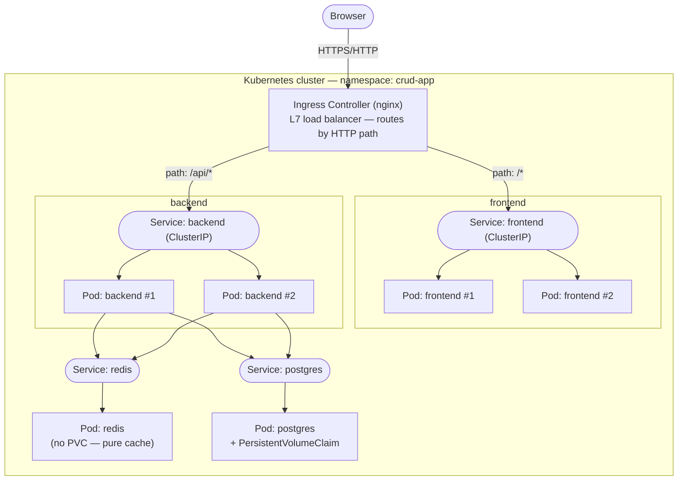
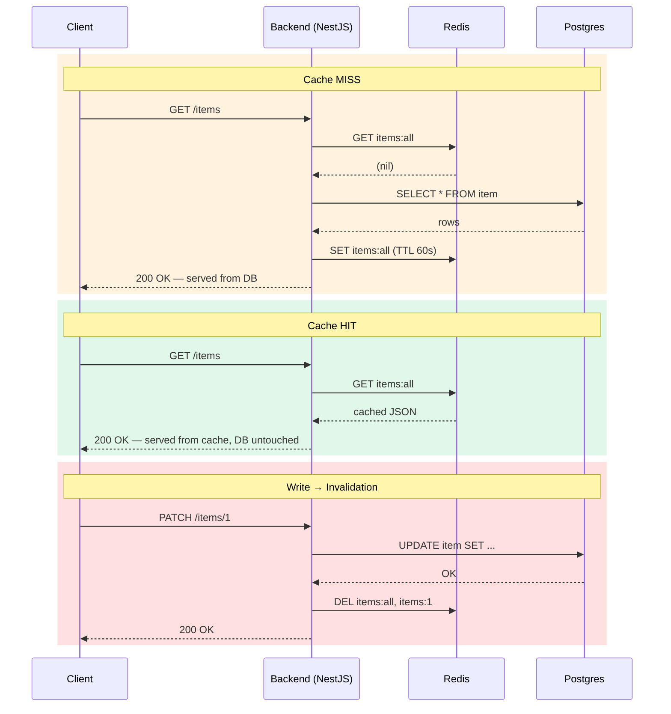

<div align="center">

# CRUD on Kubernetes — Load Balancing & Cache Invalidation

A small full-stack CRUD app used as a hands-on playground for core distributed-systems
concepts: **L7 load balancing, horizontal scaling, the cache-aside pattern with explicit
cache invalidation, and container orchestration with Kubernetes.**

[](https://nestjs.com/)
[](https://react.dev/)
[](https://www.postgresql.org/)
[](https://redis.io/)
[](https://www.docker.com/)
[](https://kubernetes.io/)
[](https://www.typescriptlang.org/)

</div>

---

## Table of contents

- [Overview](#overview)
- [System design concepts demonstrated](#system-design-concepts-demonstrated)
- [Architecture](#architecture)
- [Load balancing: L4 vs L7, and what balances what](#load-balancing-l4-vs-l7-and-what-balances-what)
- [Caching: cache-aside with explicit invalidation](#caching-cache-aside-with-explicit-invalidation)
- [Tech stack](#tech-stack)
- [Project structure](#project-structure)
- [API reference](#api-reference)
- [Getting started](#getting-started)
  - [1. Local development](#1-local-development-no-docker)
  - [2. Build Docker images](#2-build-docker-images)
  - [3. Deploy to Kubernetes](#3-deploy-to-kubernetes)
- [Observing the system under load](#observing-the-system-under-load)
- [Roadmap](#roadmap)

---

## Overview

This repo is intentionally a **simple CRUD** (create/read/update/delete "items") — the
point isn't the business logic, it's the infrastructure around it. It's built to answer,
concretely and with runnable code, questions like:

- What does a load balancer actually balance, and at which layer?
- What happens on a cache hit vs. a cache miss, and how do you keep a cache from
  serving stale data after a write?
- How does Kubernetes turn a handful of YAML files into a self-healing, horizontally
  scalable system?

Every concept below is backed by real code in this repo, not a diagram-only explanation.

## System design concepts demonstrated

| Concept | Where it lives | Why it matters |
|---|---|---|
| **L7 load balancing / routing** | [`k8s/05-ingress.yaml`](./k8s/05-ingress.yaml) | A single Ingress (nginx) is the one external entry point; it routes by HTTP path (`/api/*` → backend, `/*` → frontend) |
| **Horizontal scaling** | [`k8s/03-backend.yaml`](./k8s/03-backend.yaml), [`k8s/04-frontend.yaml`](./k8s/04-frontend.yaml) | Backend & frontend run 2 replicas each; Kubernetes Services load-balance across pod endpoints |
| **Cache-aside pattern** | [`backend/src/items/items.service.ts`](./backend/src/items/items.service.ts) | Reads check Redis before hitting Postgres; misses are populated back into the cache with a TTL |
| **Explicit cache invalidation** | same file | Every write (`POST`/`PATCH`/`DELETE`) deletes the affected cache keys so the next read can't serve stale data |
| **Fail-open resilience** | [`backend/src/redis/redis.module.ts`](./backend/src/redis/redis.module.ts) | If Redis is unreachable, the app logs a warning and falls back to Postgres instead of crashing — a cache should never be a single point of failure |
| **Health checks / self-healing** | every file in `k8s/` | `readinessProbe`/`livenessProbe` on every Deployment; Kubernetes restarts or stops routing to unhealthy pods automatically |
| **Multi-stage containerization** | [`backend/Dockerfile`](./backend/Dockerfile), [`frontend/Dockerfile`](./frontend/Dockerfile) | Build stage compiles the app; runtime stage ships only production deps on a slim Alpine base |
| **Persistent vs. ephemeral storage** | [`k8s/01-postgres.yaml`](./k8s/01-postgres.yaml) vs [`k8s/02-redis.yaml`](./k8s/02-redis.yaml) | Postgres gets a `PersistentVolumeClaim` (source of truth); Redis intentionally has none (it's a cache, safe to lose) |
| **Secrets management** | [`k8s/01-postgres.yaml`](./k8s/01-postgres.yaml) | DB credentials injected via a Kubernetes `Secret`, not hardcoded in the Deployment spec |

## Architecture



The Ingress is the only thing exposed outside the cluster. Everything past it —
Services, pods, Postgres, Redis — is internal, reachable only by cluster-internal DNS
(`backend`, `postgres`, `redis`).

## Load balancing: L4 vs L7, and what balances what

There are **two distinct load-balancing layers** in this system, each solving a
different problem:

1. **Layer 7 — the Ingress controller.** It reads the HTTP path of every request and
   decides *which application* should handle it (`/api/*` → backend, everything else →
   frontend). This requires understanding the request content, so it has to operate at
   L7. It talks directly to pod endpoints (bypassing kube-proxy) and load-balances
   across them using round-robin by default.
2. **Layer 4 / kube-proxy — the Kubernetes Services.** Any traffic sent to a Service's
   ClusterIP (e.g. `backend:3000` from inside the cluster) gets distributed across that
   Service's healthy pod endpoints at the connection level, with no awareness of HTTP
   content.

**Rule of thumb:** reach for L7 when routing decisions depend on *what's inside* the
request (path, host, headers, TLS termination) — that's this project's Ingress. Reach
for L4 when you just need to spread raw connections as fast as possible and the
protocol isn't HTTP (gRPC streams, raw TCP/UDP, database traffic).

## Caching: cache-aside with explicit invalidation



Why invalidation instead of just a short TTL? A TTL alone means clients can see stale
data for up to 60 seconds after every write — acceptable for some use cases, not for a
CRUD where the user just clicked "save" and expects to see it reflected immediately.
Deleting the affected keys on every write guarantees the *next* read is always correct,
while the TTL still acts as a safety net for keys nobody explicitly invalidated.

## Tech stack

| Layer | Choice |
|---|---|
| Backend | [NestJS](https://nestjs.com/) + [TypeORM](https://typeorm.io/) |
| Frontend | [React](https://react.dev/) + [Vite](https://vitejs.dev/) |
| Database | [PostgreSQL](https://www.postgresql.org/) |
| Cache | [Redis](https://redis.io/) (via `ioredis`) |
| Containers | Docker, multi-stage builds, Alpine runtime images |
| Orchestration | Kubernetes — Deployments, Services, Ingress (nginx), Secrets, PVC |
| Ingress controller | [ingress-nginx](https://kubernetes.github.io/ingress-nginx/) (installed via Helm) |

## Project structure

```
.
├── backend/                 NestJS API
│   ├── src/
│   │   ├── items/           CRUD module (controller, service, DTOs, entity)
│   │   ├── redis/           Redis client provider (fail-open cache client)
│   │   └── app.module.ts    Wires TypeORM (Postgres) + Config + ItemsModule
│   └── Dockerfile           Multi-stage build → slim runtime image
├── frontend/                 React + Vite SPA
│   ├── src/
│   │   ├── api.js            Fetch wrapper, base URL from VITE_API_URL
│   │   └── App.jsx           List / create / edit / delete UI
│   ├── nginx.conf            Static file server config for the runtime image
│   └── Dockerfile            Multi-stage build → nginx runtime image
└── k8s/                       Kubernetes manifests, applied in order
    ├── 00-namespace.yaml
    ├── 01-postgres.yaml       Secret + PVC + Deployment + Service
    ├── 02-redis.yaml          Deployment + Service (no PVC)
    ├── 03-backend.yaml        Deployment (2 replicas) + Service
    ├── 04-frontend.yaml       Deployment (2 replicas) + Service
    └── 05-ingress.yaml        L7 load balancer / router
```

## API reference

| Method | Path | Description |
|---|---|---|
| `GET` | `/items` | List all items (cache-aside on `items:all`) |
| `GET` | `/items/:id` | Get one item (cache-aside on `items:{id}`) |
| `POST` | `/items` | Create an item → invalidates `items:all` |
| `PATCH` | `/items/:id` | Update an item → invalidates `items:all` and `items:{id}` |
| `DELETE` | `/items/:id` | Delete an item → invalidates `items:all` and `items:{id}` |
| `GET` | `/health` | Liveness/readiness endpoint used by Kubernetes probes |

## Getting started

### 1. Local development (no Docker)

```bash
# Backend — requires local Postgres + Redis reachable
cd backend
cp .env.example .env
npm install
npm run start:dev

# Frontend
cd frontend
cp .env.example .env      # VITE_API_URL=http://localhost:3000
npm install
npm run dev
```

### 2. Build Docker images

```bash
docker build -t load-balancer-backend:local ./backend
docker build -t load-balancer-frontend:local ./frontend
```

Both images have been verified with an end-to-end smoke test (Postgres + Redis +
backend wired together via a Docker network, exercising every CRUD endpoint and the
cache hit/miss/invalidation flow via `curl` + `redis-cli`).

### 3. Deploy to Kubernetes

Tested against **Docker Desktop's built-in Kubernetes**, which shares the same image
store as your local Docker daemon — no registry push required.

1. **Enable Kubernetes**: Docker Desktop → *Settings → Kubernetes → Enable Kubernetes*.

2. **Install the Ingress controller** (once per cluster):
   ```bash
   helm repo add ingress-nginx https://kubernetes.github.io/ingress-nginx
   helm repo update
   helm install ingress-nginx ingress-nginx/ingress-nginx \
     --namespace ingress-nginx --create-namespace
   kubectl get pods -n ingress-nginx -w   # wait for Running
   ```

3. **Apply the manifests**:
   ```bash
   kubectl apply -f k8s/
   kubectl get pods -n crud-app -w
   ```

4. **Open the app**: [http://localhost/](http://localhost/) — Docker Desktop exposes
   the Ingress controller's `LoadBalancer` Service directly on `localhost`.

## Observing the system under load

```bash
kubectl get all -n crud-app                                # full state
kubectl logs -n crud-app -l app=backend -f                  # tail both backend replicas
kubectl scale deployment backend --replicas=4 -n crud-app   # scale live
kubectl delete -f k8s/                                       # tear down
```

To *see* load balancing happen: scale the backend up and repeatedly hit `/api/items`
while tailing logs from all pods — requests visibly alternate between replicas. To see
cache invalidation happen: `curl` an item, `PATCH` it, then `curl` it again — the
response reflects the update immediately instead of the stale cached value.